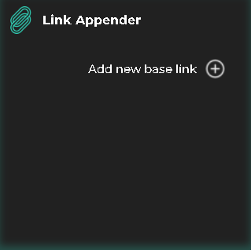
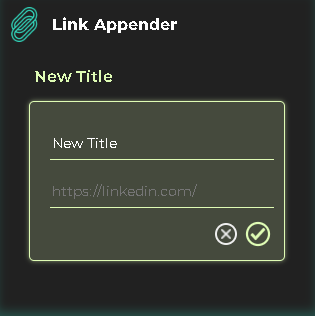

# Link Appender Extension

A simple and easy to use Link Appender extension. 

### Steps:

1. Click on 'Add new base link'

2. Input your base Title and base URL. Save.

3. To use, open your newly created base tab, enter suffix and press 'Enter' (your link will open in a new window in your browser)

4. You can edit both your Title and the base URL, as well as delete your link base entirely. 
    - To delete, click on your base tab and press the bin icon. 
    - To edit, click on your base tab and press the pen icon.
        - Input new title/URL base. Save. 

### Tech used: 

- [x] React (react-router-dom)
- [x] styled-components, CSS (minimal)

## Project images 

